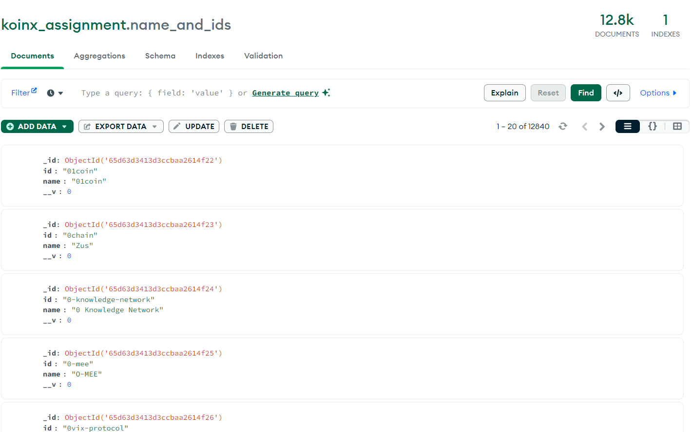
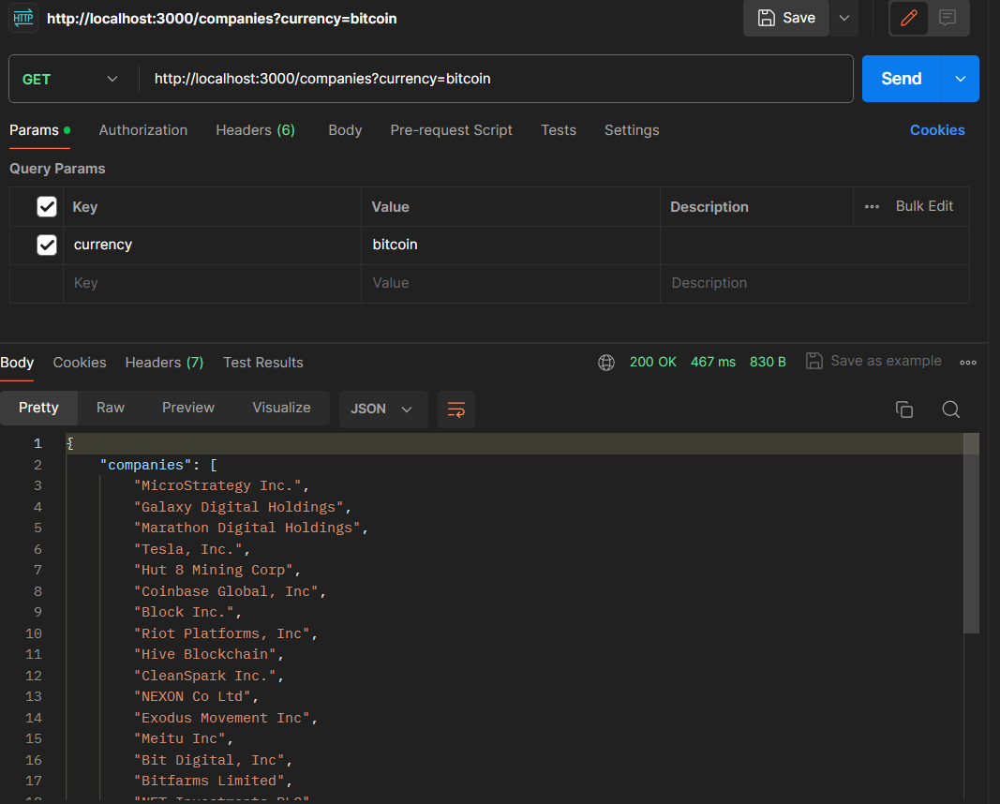

# Koinx Assignment

This repository contains code for a Node.js application that interacts with the Coingecko API to fetch cryptocurrency data, store it in a MongoDB database, and provide API endpoints for converting currencies and retrieving information about companies holding specific cryptocurrencies.

## Installation

To install and run this application locally, follow these steps:

1. Clone the repository:

   ```bash
   git clone https://github.com/vinsin2002/koinx_assignment
   ```
2. Navigate to the project directory:

```bash
cd koinx_assignment
```
3. Install dependencies:
```bash
npm install
```
4. Create a .env file in the root directory of the project and add the following line, replacing <YOUR_MONGODB_URI> with your MongoDB Atlas database URL:

```plaintext
MONGODB_URI=<YOUR_MONGODB_URI>
```
##Functionality
###1. Fetching and Storing Cryptocurrency Data
The application automatically fetches data about cryptocurrencies from the Coingecko API and stores it in the MongoDB database. The collection name for storing cryptocurrency names and IDs is names_and_ids. This process is scheduled to run every hour.

###2. Converting Currencies
You can convert currencies using the /convert API endpoint. Provide the following parameters in the request body:

- `fromCurrency`: The cryptocurrency you want to convert from.
- `toCurrency`: The cryptocurrency you want to convert to.
- `date`: The date for which you want to retrieve the conversion rate.
Example request body:

```json
{
  "fromCurrency": "bitcoin",
  "toCurrency": "basic-attention-token",
  "date": "12-01-2023"
}
```
###3. Retrieving Companies Holding Cryptocurrencies
You can retrieve a list of companies holding a specific cryptocurrency using the /companies API endpoint. Provide the currency parameter with the name of the cryptocurrency (e.g., "bitcoin") to get the list of companies holding that cryptocurrency.

Example request:

```bash
GET /companies?currency=bitcoin
```

##Usage
After following the installation steps, you can start the application by running:

```bash
npm start
```
The application will start running on http://localhost:3000. You can then use the provided API endpoints to interact with the application.

#Screenshots




